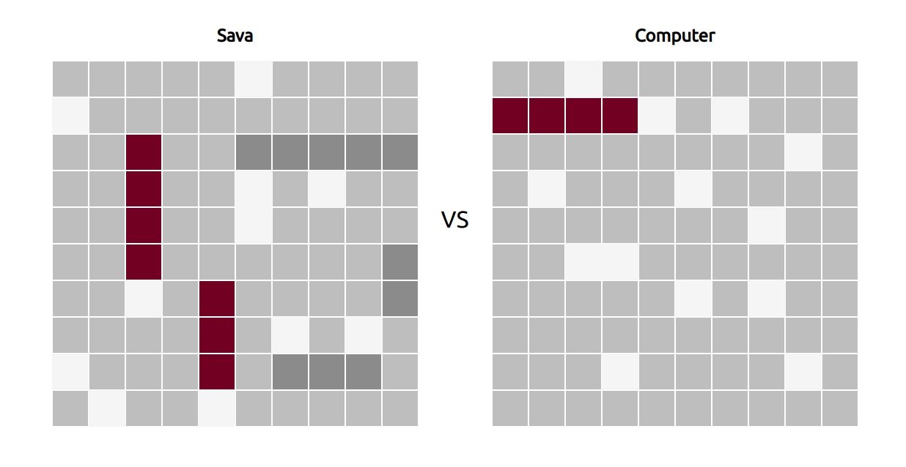

# Battleship

Classic Battleship game in the browser

This repository is created as a solution to [this challenge](https://www.theodinproject.com/courses/javascript/lessons/battleship) in [The Odin Project Javascript curriculum](https://www.theodinproject.com/courses/javascript).

### Installing dependencies

In order to successfully install dependencies and run the application, it is required to have Node.js and npm installed. Further instructions for downloading and installing Node can be found on [official Node website](https://nodejs.org/en/)

`npm install`

### Running the application

`npm run dev`

### Building for production

`npm run build`

All required files will be generated inside of `dist` folder after the command above is executed

### Running tests

`npm test`